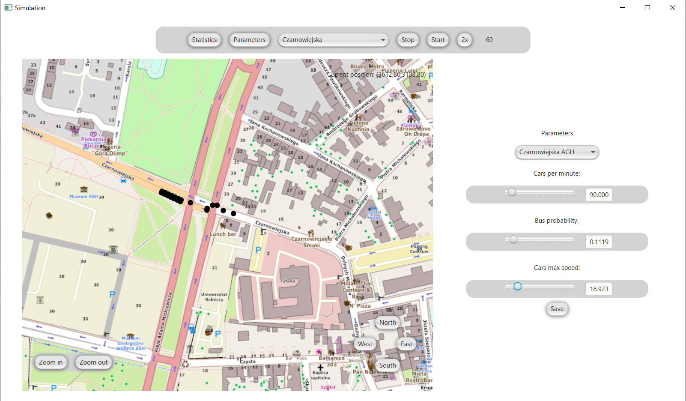

# Car-Motion-Simulation
Simulation of car motion in Kraków using Nagel-Schreckenberg-Model.
User can specify how many cars, buses enter the simulation, watch statistics and current car position on map, crossings are equipped with traffic lights.

### Application

Application consist of:
- map of Kraków (downloaded from [Open Street Map](https://www.openstreetmap.org)) containing cars, user can navigate and change map zoom level 
- upper menu to change simulation speed, select specified crossing, select statistics or parameters menu
- parameters menu to select cars entering the simulation, buses and speed of vehicles.
- statistics chart to see how many vehicles leaves simulation

### Future work:

- add support of other crossing
- change statistics chart to show better data